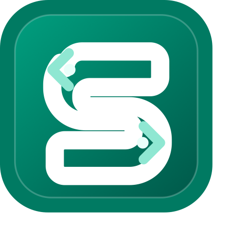

<p align="center">
  
</p>

# Sealtun

[English](./README_EN.md) · [QuickStart](./QuickStart.md) · [Changelog](./CHANGELOG.md)

**Sealos Cloud 原生的本地隧道 CLI：一条命令，把本地服务送上公网。**

本地跑着 Web、API、数据库或调试服务，一行命令就能拿到带 HTTPS 的公网地址——发给同事预览、接进 webhook 回调、用手机扫码访问。认证、限流、审计、自定义域名、请求重放、声明式 YAML，还有一个完整的 Web 控制台，全在这一个二进制里。

```bash
sealtun login
sealtun expose 3000
# => https://sealtun-xxxx-ns-xxxx.sealosgzg.site
```

## 功能总览

**隧道能力**

- **HTTPS 隧道**：Ingress + 反向代理，本地端口或远端 HTTP upstream 一键暴露；`--route /api=8080` 多服务路由（前缀自动剥离，`Location` 重定向自动补回）；`--ttl 2h` 到期自动删除；`--qr` 终端打印二维码，手机扫码即开
- **TCP 隧道**：`expose 22/5432 --protocol tcp`，NodePort 直连，覆盖 SSH、数据库、MQTT 等任意 TCP 服务（`--protocol ssh` 保留为兼容别名，端口 22 自动输出 ssh 连接提示）
- **访问控制**：Basic Auth、Bearer Token、IP 黑白名单、限流、审计日志，代理层执行，token 只存哈希
- **临时分享链接**：`tunnel share create --ttl 1h` 生成限时免密链接，随时吊销
- **自定义域名**：`tunnel domain add app.example.com`，CNAME 验证 + cert-manager 自动签发证书
- **请求记录与重放**：`tunnel requests` 捕获公网请求（headers 脱敏、body 预览），`tunnel requests replay` 一键重放到本地服务——webhook 调试利器

**Web 控制台**

- `sealtun ui` 打开本地 Web 控制台（浅色 Sealos 风格）：隧道创建/启停/删除、本地端口发现、请求日志与重放、访问策略、分享链接、自定义域名、诊断、profile/workspace 管理，全部可视化操作
- 面向不熟悉 CLI 的使用者；只监听 127.0.0.1，随机端口 + 随机会话 token 保护

**账号与工作区**

- OAuth 设备流登录；`login --qr` 在没有浏览器的机器上手机扫码完成登录
- `workspace list/use` 在同一 region 内一键切换 namespace，隧道建在哪清晰可见
- 内置多 region（gzg / hzh / bja / cloud / usw），命名 profile 让多套账号并存、一键切换
- 凭证过期或集群 CA 轮换时自动使用 refresh token 续期，无需反复登录

**工程化**

- `up` 智能入口：自动发现本地端口、交互式引导、复用项目隧道，默认建议 2 小时 TTL 防止忘关计费
- `apply -f sealtun.yaml` 声明式管理多条隧道：dry-run 预览、diff 对比、幂等更新，name 即稳定 ID
- 运维三件套：`doctor` 诊断与保守修复、`tunnel logs` 远端 Pod 日志、`tunnel inspect --remote/--metrics/--resources` 深度巡检
- 收敛的命令树：12 个顶层命令，隧道操作统一收进 `tunnel` 子命令（旧命令保留兼容别名，脚本不用改）

## 命令一览

```
sealtun
├── 核心流程
│   ├── expose      暴露本地端口或 HTTP upstream
│   ├── up          智能引导创建（expose 的交互入口）
│   ├── apply       声明式 YAML 创建/更新隧道
│   └── tunnel      管理已有隧道
│       ├── list / inspect / logs / requests
│       ├── stop / start / cleanup / rotate-secret
│       ├── access    访问策略与审计（show / set / audit）
│       ├── share     临时分享链接（create / rotate / revoke）
│       └── domain    自定义域名（plan / add / verify / status / clear）
├── 账号与范围
│   ├── login / logout / status
│   ├── region      region 查询
│   ├── profile     命名登录配置管理
│   └── workspace   namespace 查询与切换
└── 运维
    ├── doctor      诊断与修复
    └── ui          本地 Web 控制台
```

## 快速开始

```bash
npm install -g sealtun
sealtun login          # 浏览器授权；无浏览器环境加 --qr 手机扫码
sealtun up             # 交互式创建第一条隧道（自动发现本地端口）
```

安装方式、访问控制、自定义域名、TCP/SSH、Web 控制台、声明式配置的完整用法见 [QuickStart.md](./QuickStart.md)。

## 成本说明

Sealtun 本身不收软件费。成本来自 Sealos Cloud 为隧道分配的 Pod（CPU + 内存）、公网端口和网络流量，按小时计费，各 region 单价见 Sealos Cloud 控制台价格页。

压低成本：`tunnel stop` 不用的隧道缩容到 0、YAML `resources` 调低 requests/limits、短时调试隧道加 `--ttl` 自动销毁。

## 许可证

MIT License.
