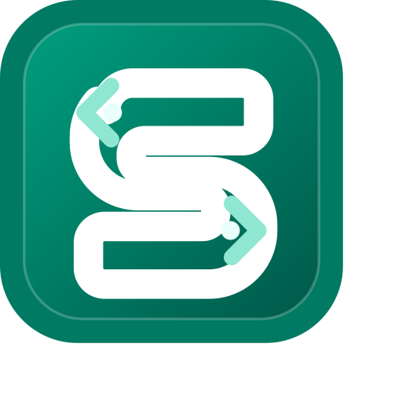

<p align="center">
  
</p>

# Sealtun

[中文版本](./README.md)

Sealtun is a local tunnel CLI for **Sealos Cloud** and **Kubernetes** users. It can quickly publish local Web apps, remote HTTP upstreams, SSH, databases, or debugging services to the internet, and on Linux it can also let local tools directly access in-cluster Services and Pods.

## Features

- 🔑 **Password-less OAuth2 Login**: Connect easily with `sealtun login` using the Device Authorization Grant flow.
- 🌍 **Region Switching**: List built-in Sealos Cloud regions and switch regions by re-running login with `sealtun region use`.
- 👤 **Named Profiles**: Save different Sealos accounts, regions, workspaces, and kubeconfigs as named profiles and switch between them.
- 🚀 **One-Command Expose**: Run `sealtun expose 8080` or `sealtun expose --target http://10.0.0.12:8080` to get a trusted HTTPS URL.
- 🌐 **Custom Domain Automation**: Use `domain plan/add/verify/status/doctor` to generate CNAME guidance, wait for DNS, attach domains, and inspect certificate readiness.
- 🔗 **Temporary Share Links and Rotation**: Use `share create/list/revoke/rotate` to generate, revoke, or rotate expiring links for HTTPS tunnels.
- 🛡️ **Security Operations**: HTTPS tunnels support Basic Auth, Bearer tokens, temporary links, IP rules, rate limits, access audit, and server secret rotation.
- 📊 **Status, Diagnostics, and Workbench**: Use `doctor <tunnel-id>`, `inspect --remote`, `logs`, `events`, `metrics`, and `dashboard` to diagnose local ports, daemon state, remote Pods, Services, Ingresses, and certificates, or manage tunnels from the local workbench.
- 🧭 **Guided UX and Safe Fixes**: Use `init` for first-run command/YAML recommendations, and `resources`, `watch`, or `doctor --fix --dry-run` to understand and conservatively repair tunnel state.
- 🔌 **Cluster Service Access**: On Linux, `sudo sealtun connect` lets TCP clients directly reach Service FQDNs, Service ClusterIPs, and Pod IPs without SOCKS or client-side proxy config.
- 🧩 **Protocol Templates**: Use `template https|ssh|tcp|mysql|postgres|redis|mqtt` to generate commands and `sealtun.yaml` examples.
- 🧾 **Declarative Config**: Use `apply -f sealtun.yaml` to declare tunnels in YAML and create or update them with stable names; use `export` to turn local sessions back into YAML.
- 🌐 **Optimized for Sealos**: Native support for Sealos Cloud domains, certificates, and Kubernetes resources.

## Installation / Setup

Install the `sealtun` CLI with npm, or download the binary for your platform from GitHub Releases. Remote tunnel Pods use the matching `ghcr.io/gitlayzer/sealtun` container image.

For development or prerelease smoke tests, `SEALTUN_SERVER_IMAGE` can override the remote Pod image. Normal users do not need to set it.

Install globally with npm:

```bash
npm install -g sealtun
sealtun --version
```

Run temporarily with npx:

```bash
npx sealtun@latest --version
npx sealtun@latest login
```

The npm package installs the matching platform-specific optional binary package automatically. It currently supports macOS, Linux, and Windows on `amd64/x64` and `arm64`.

On Windows, global npm installs can fail when nvm-windows is in use or when Node/npm lives under a directory that requires administrator permissions. Prefer `npx sealtun@latest --version` for a one-off run, or move the npm global prefix to a user-writable directory:

```powershell
npm config set prefix "$env:APPDATA\npm"
$env:PATH += ";$env:APPDATA\npm"
npm install -g sealtun
sealtun --version
```

If npm reports that `@gitlayzer/sealtun-win32-x64` or `@gitlayzer/sealtun-win32-arm64` cannot be found, make sure you did not install with `--omit=optional` and did not set `npm config set optional false`. If the global install path is still blocked, use the PowerShell GitHub Release download below.

Quick install for macOS / Linux:

```bash
OS="$(uname -s | tr '[:upper:]' '[:lower:]')"
ARCH="$(uname -m)"
case "$ARCH" in
  x86_64) ARCH="amd64" ;;
  arm64|aarch64) ARCH="arm64" ;;
  *) echo "unsupported arch: $ARCH" >&2; exit 1 ;;
esac

curl -L "https://github.com/gitlayzer/sealtun/releases/latest/download/sealtun_${OS}_${ARCH}.tar.gz" -o sealtun.tar.gz
tar -xzf sealtun.tar.gz sealtun
chmod +x sealtun
sudo mv sealtun /usr/local/bin/sealtun
sealtun --version
```

Quick download for Windows PowerShell:

```powershell
$arch = if ([System.Runtime.InteropServices.RuntimeInformation]::OSArchitecture -eq "Arm64") { "arm64" } else { "amd64" }
Invoke-WebRequest -Uri "https://github.com/gitlayzer/sealtun/releases/latest/download/sealtun_windows_$arch.zip" -OutFile sealtun.zip
Expand-Archive .\sealtun.zip -DestinationPath .
.\sealtun.exe --version
```

For local development, build from source:

```bash
git clone https://github.com/gitlayzer/sealtun.git
cd sealtun
make build
./sealtun --version
```

## Codex Skill

This repository includes `skills/sealtun` so Codex-like AI agents can understand and use the Sealtun CLI more accurately. The skill is designed to passively match requests about `sealtun`, `sealtun.yaml`, local tunneling, exposing a local port, temporary public preview links, third-party callbacks to a local service, tunnel access control, public SSH, or generic TCP tunnels.

After the skill triggers, it first checks whether the request is actually about making a local/dev service public through Sealtun. It then follows a fixed guidance, live operation, or troubleshooting workflow. Unless the user explicitly asks for execution, it will not run state-changing commands such as `sealtun expose/apply/domain set/stop/cleanup/logout`.

Install the skill directly from the repository:

```bash
npx skills add https://github.com/gitlayzer/sealtun
```

For local development in this repository, you can also sync the directory into Codex's global skills directory:

```bash
mkdir -p ~/.codex/skills
cp -R skills/sealtun ~/.codex/skills/sealtun
```

## Quick Start

Shortest path:

```bash
# 1. Login to Sealos
sealtun login

# 2. Discover local ports and print recommended commands
sealtun init

# 3. Publish a local Web service, for example localhost:3000
sealtun expose 3000

# 4. Inspect status, diagnosis, and logs
sealtun list
sealtun doctor
sealtun logs <tunnel-id>

# 5. Stop, resume, or clean up
sealtun stop <tunnel-id>
sealtun start <tunnel-id>
sealtun cleanup <tunnel-id>
```

Access in-cluster Services/Pods from Linux:

```bash
sealtun connect --check
sudo sealtun connect
```

### 1. Login to Sealos
Perform the device authentication (which operates smoothly without passwords similar to `gh auth login`):
```bash
sealtun login

# List supported regions
sealtun region list

# Switch to another region
sealtun region use hzh

# Login and save credentials as a named profile
sealtun login gzg --profile gzg-main

# List and switch saved profiles
sealtun profile list
sealtun profile use hzh-dev
```
Built-in regions:

| Name | Region API | Ingress domain suffix |
| --- | --- | --- |
| `gzg` | `https://gzg.sealos.run` | `sealosgzg.site` |
| `hzh` | `https://hzh.sealos.run` | `sealoshzh.site` |
| `bja` | `https://bja.sealos.run` | `sealosbja.site` |
| `cloud` | `https://cloud.sealos.io` | `cloud.sealos.io` |
| `usw` | `https://usw-1.sealos.io` | `usw-1.sealos.app` |

*Note: Only built-in Sealos Cloud regions are currently supported. Login retrieves your Kubernetes credentials and the region's `SEALOS_DOMAIN`, then stores them under `~/.sealtun`. Named profiles are stored under `~/.sealtun/profiles/<name>`, and switching profiles replaces the active `auth.json` and `kubeconfig`.*

### 2. Expose a local port
For instance, to make your local Web Server running on Port `3000` accessible to everyone on the Internet:
```bash
# First-time guidance prints a recommended command and sealtun.yaml without creating resources
sealtun init
sealtun init --protocol auto --json

# Create the recommended tunnel only when you are ready
sealtun init --apply

# Default https protocol (compatible with WebSocket)
sealtun expose 3000

# Or forward the public HTTPS entry to an HTTP upstream reachable from this machine
sealtun expose --target http://10.0.0.12:8080

# Private HTTPS upstreams with self-signed certificates can explicitly skip upstream certificate verification
sealtun expose --target https://10.0.0.12:8443 --target-insecure-skip-verify

```

`--target` applies only to default HTTPS tunnels. The target must be a `http://` or `https://` address reachable from the machine running the Sealtun CLI. SSH/TCP L4 tunnels continue to use the local port plus NodePort model. `--target-insecure-skip-verify` affects only the Sealtun client to HTTPS upstream TLS check, is off by default, and should be used only for private/self-signed upstreams.

Enable Basic Auth for public application traffic:
```bash
# Recommended: read the password from the environment to avoid shell history
export SEALTUN_BASIC_AUTH_PASSWORD='change-me'
sealtun expose 3000 --basic-auth-user admin --basic-auth-password-env SEALTUN_BASIC_AUTH_PASSWORD

# One-shot form is also supported
sealtun expose 3000 --basic-auth admin:change-me
```

Basic Auth is enforced by the Sealtun server proxy layer, not by Ingress annotations. It protects only public application paths and does not block the `/_sealtun/ws` tunnel control channel, health checks, or metrics protected by the internal Bearer secret.

You can also enable proxy-layer access policies without depending on Ingress annotations:
```bash
# Bearer Token
export SEALTUN_BEARER_TOKEN='share-secret'
sealtun expose 3000 --bearer-token-env SEALTUN_BEARER_TOKEN

# IP allowlist / denylist, supporting single IPs and CIDR ranges
sealtun expose 3000 --ip-allowlist 203.0.113.10,198.51.100.0/24 --ip-denylist 198.51.100.9

# Temporary access link, expiring after 1 hour by default
export SEALTUN_TEMP_TOKEN='review-link-secret'
sealtun expose 3000 --temporary-access-token-env SEALTUN_TEMP_TOKEN --temporary-access-ttl 1h

# Rate limit and access audit
sealtun expose 3000 --rate-limit 60/m --audit
```

Bearer and temporary-link tokens must be at least 8 characters. They are stored only as SHA-256 hashes and are not written into Deployment args. Temporary links use `?_sealtun_token=...`; Sealtun strips that query parameter before forwarding the request to your local service or `--target` upstream. IP rules prefer the `X-Real-IP` value set by the Ingress/proxy and fall back to the last valid proxy-confirmed client IP in `X-Forwarded-For`. When Basic Auth and Bearer/temporary tokens are both configured, either authentication method can grant access. `--rate-limit` uses fixed-window specs such as `60/m` or `1000/h`; access audit records only allow/deny reason, status, path, and client IP, never plaintext tokens, Authorization headers, or Basic Auth passwords.

Create, list, and revoke temporary share links for an existing HTTPS tunnel:
```bash
# Generate a token automatically. The URL is shown only once.
sealtun share create <tunnel-id> --name review --ttl 1h

# List metadata without revealing tokens
sealtun share list <tunnel-id>

# Rotate a named link. The old token is invalidated and the new URL is shown once.
sealtun share rotate <tunnel-id> review --ttl 1h

# Revoke a named share link
sealtun share revoke <tunnel-id> review
```

`share` only applies to HTTPS tunnels. SSH/TCP L4 entries do not have an HTTP query-token layer and therefore do not support temporary share links.

Show and update HTTPS access policy:
```bash
sealtun policy show <tunnel-id>
sealtun policy set <tunnel-id> --rate-limit 60/m --audit
sealtun policy set <tunnel-id> --clear-rate-limit
sealtun policy set <tunnel-id> --no-audit

# Show the last 10 minutes of access audit events
sealtun policy audit <tunnel-id> --since 10m
sealtun policy audit <tunnel-id> --since 10m --json
```

Rotate the tunnel server secret:
```bash
sealtun rotate <tunnel-id> --server-secret
```

The new server secret is printed only once and saved back to the local session; the remote tunnel rolls to the new secret. `policy`, `share`, and `rotate` operate on the tunnel represented by the local session. HTTPS access policies do not apply to SSH/TCP NodePort traffic.

### 3. Public SSH access
If the Sealos region supports public TCP NodePort, use the L4 SSH mode to connect directly to the public host and port:

```bash
# macOS/Linux commonly use port 22; replace it if your local sshd listens elsewhere
sealtun expose 22 --protocol ssh
```

The command prints a public SSH endpoint:
```bash
ssh <user>@<public-host> -p <node-port>
```

Or add an SSH config entry and then run `ssh sealtun-dev`:
```sshconfig
Host sealtun-dev
  HostName <public-host>
  User <user>
  Port <node-port>
```

`--protocol ssh` exposes only a public TCP NodePort for user traffic and does not provide a default HTTPS application URL. Sealtun still keeps an internal control channel so the local daemon can connect to the remote pod, but that channel is not a user-facing SSH entry. Basic Auth, Bearer tokens, temporary links, IP policies, and custom domains apply only to HTTPS tunnels, not to the L4 SSH entry. The older WebSocket ProxyCommand fallback remains available:

```bash
ssh -o ProxyCommand='sealtun ssh connect <tunnel-id>' <user>@sealtun
```

### 4. Public generic TCP access
Generic L4 TCP tunnels can expose local databases, debugging services, or other non-HTTP protocols:

```bash
sealtun expose 5432 --protocol tcp
```

The command prints a public TCP endpoint:
```bash
<public-host>:<node-port>
```

`--protocol tcp` uses the same public TCP NodePort model as `--protocol ssh`. HTTPS remains only as the internal control channel for the local daemon and is not a default public application URL. Basic Auth, Bearer tokens, temporary links, IP policies, and custom domains are HTTPS proxy-layer features and do not apply to L4 TCP entries.

### 5. Use a custom domain
Create the tunnel first and print the Sealos-managed CNAME target:
```bash
sealtun expose 3000 --domain app.example.com

# If you will configure DNS while the command waits, verify CNAME, attach it, and wait for the certificate
sealtun expose 3000 --domain app.example.com --wait-domain
```

Or attach one to an existing tunnel after DNS is ready:
```bash
# Show the DNS record you need first
sealtun domain plan <tunnel-id> app.example.com

# Attach after DNS is ready
sealtun domain set <tunnel-id> app.example.com

# Or wait for DNS, attach automatically, and keep waiting for certificate readiness
sealtun domain add <tunnel-id> app.example.com --wait --timeout 5m
```

Sealtun keeps a Sealos-managed host as the tunnel control endpoint and CNAME target. It writes the custom host to Ingress and creates cert-manager `Issuer` and `Certificate` resources only after the CNAME points to that Sealos host. Configure DNS at your provider:
```text
CNAME app.example.com -> <sealos-host>
```

Verify DNS, Ingress, and certificate readiness:
```bash
sealtun domain verify <tunnel-id>

# Keep waiting until DNS and certificate are ready or the timeout expires
sealtun domain verify <tunnel-id> --wait --timeout 5m

# Summarize every configured custom domain
sealtun domain status

# Run deeper diagnostics for one custom domain
sealtun domain doctor <tunnel-id>
```

Remove the custom domain:
```bash
sealtun domain clear <tunnel-id>
```

### 6. Access services inside the cluster
`sealtun expose` makes a local service public. `sealtun connect` goes the other direction: local tools can directly reach Service FQDNs, Service ClusterIPs, and Pod IPs inside the current Sealos/Kubernetes namespace. It only uses the active Sealtun profile/region/namespace and kubeconfig, so users do not need to manually change RBAC.

Linux currently supports transparent TCP mode. Sealtun temporarily updates local `iptables` and `/etc/hosts`, then forwards intercepted TCP connections through Kubernetes `pods/portforward`. This is not a SOCKS/HTTP proxy, and clients do not need proxy configuration.
```bash
sealtun connect --check
sealtun connect --check --json
sudo sealtun connect
sudo sealtun connect --namespace ns-3rgvtt74
```

`sealtun connect` runs in the foreground by default. Keep that terminal open, or stop it from another terminal with `sudo sealtun disconnect`; a normal `Ctrl-C` or `disconnect` cleans up the `iptables` rules and `/etc/hosts` block written by Sealtun.

After connect starts, use normal client commands:
```bash
curl http://my-service.ns-3rgvtt74.svc.cluster.local:8080
curl http://10.96.0.12:8080      # Service ClusterIP
curl http://10.244.0.22:3000     # Pod IP
```

Inspect or stop the current cluster connect session:
```bash
sealtun connect status
sealtun connect status --json
sudo sealtun disconnect
```

Limitations: transparent data-plane support is Linux + TCP only and requires root plus `iptables`; ICMP/ping and UDP are not supported. macOS/Windows fail clearly as unsupported for now.

### 7. Observe tunnels and run the local dashboard
Show remote tunnel pod logs:
```bash
sealtun logs <tunnel-id>
sealtun logs <tunnel-id> --tail 200
sealtun logs <tunnel-id> --follow
```

Show tunnel metrics:
```bash
sealtun metrics <tunnel-id>
sealtun metrics <tunnel-id> --json
```

Show recent Kubernetes events:
```bash
sealtun events <tunnel-id>
sealtun events <tunnel-id> --json
```

Discover local listening ports and get protocol template hints:
```bash
sealtun discover
sealtun discover --protocol tcp
sealtun discover --json --limit 20
```

Show Kubernetes resource occupancy hints for one tunnel:
```bash
sealtun resources <tunnel-id>
sealtun resources <tunnel-id> --json
```

Run local and remote diagnostics:
```bash
# Global health check
sealtun doctor

# Single-tunnel diagnosis with local port, daemon, remote resource, and next-step suggestions
sealtun doctor <tunnel-id>
sealtun doctor <tunnel-id> --json

# Show conservative automatic fixes without executing them
sealtun doctor --fix --dry-run

# Execute low-risk fixes: resume stopped tunnels, clean expired/stale tunnels, start the local daemon
sealtun doctor --fix
```

Watch tunnel or global status in real time:
```bash
sealtun watch
sealtun watch <tunnel-id>
sealtun watch <tunnel-id> --json
```

Stop, resume, and clean up tunnels:
```bash
sealtun stop <tunnel-id>
sealtun start <tunnel-id>
sealtun cleanup
sealtun cleanup <tunnel-id>
sealtun cleanup --all
```

`stop` preserves the domain, Service, Ingress, NodePort Service, and local session while scaling the remote Pod replicas to 0; `start` reopens the same tunnel. Default `cleanup` removes stopped, expired, stale, or error tunnels, and `cleanup <tunnel-id>` targets one eligible tunnel. `cleanup --all` force-cleans every remote resource tied to local records and should only be used when you intentionally want to delete all tunnels.

`metrics` combines local session state, remote Deployment/Pod/Ingress readiness, and server-side request counters when the remote pod supports the Bearer-secret-protected `/_sealtun/metrics` endpoint. TCP/SSH tunnels also expose TCP connection, active connection, byte, and error counters.

Run the local workbench:
```bash
sealtun dashboard

# Custom listen address
sealtun dashboard --addr 127.0.0.1 --port 19777

# Open the browser after startup
sealtun dashboard --open
```

The dashboard listens locally by default and uses only the current active profile/region/namespace. It reads local sessions, login state, remote diagnostics, and custom domain readiness. The page can create HTTPS/SSH/TCP tunnels; the HTTPS form supports either a local port or a `Target URL` upstream. It can also run `sealtun.yaml` dry-run/diff/apply, stop/start/cleanup tunnels, view logs/metrics/events/resources/audit, and run domain plan/add/verify/clear, policy set, share rotate, and server secret rotate. Before write confirmations, it previews the equivalent CLI command so the UI operation is not a black box.

The dashboard prefers live status updates and shows `Live`, `Reconnecting`, `Polling`, or `Disconnected` in the top bar; if the live stream fails it falls back to 15-second polling. The `Resources` tab shows the tunnel's Deployment, Pods, HTTP Service, TCP NodePort Service, Ingress, Certificate, Issuer, and Secret summaries. Resource visibility is not cloud billing estimation; it only highlights current Sealos/Kubernetes occupancy such as replica count, Pod count, Service type, NodePort, Ingress host count, and certificate presence. Secrets expose only name, type, and metadata, never data. The `New Tunnel` panel can also run `Discover local ports` to scan local TCP listening ports and prefill protocol, name, and localPort.

```bash
# Allow remote access to the workbench; use only on trusted networks
sealtun dashboard --addr 0.0.0.0 --allow-remote --basic-auth admin:change-me

# Prefer reading the dashboard Basic Auth password from the environment
export SEALTUN_DASHBOARD_PASSWORD='change-me'
sealtun dashboard --addr 0.0.0.0 --allow-remote --basic-auth-user admin --basic-auth-password-env SEALTUN_DASHBOARD_PASSWORD
```

Remote mode does not embed the dashboard token in HTML; callers need the URL fragment token or request header. When dashboard Basic Auth is enabled, HTML, static assets, and APIs are all protected before the dashboard token layer. Every mutating action still requires a page confirmation and a backend-validated `confirm` field to avoid accidental clicks or scripted misuse.

### 8. Protocol templates
When you are unsure which command or declarative config to use, generate a template first:

```bash
sealtun template https --name web --port 3000 --domain app.example.com
sealtun template ssh
sealtun template postgres
sealtun template redis --name cache
```

Templates print both a one-shot `sealtun expose` command and a `sealtun.yaml` snippet. `mysql`, `postgres`, `redis`, and `mqtt` templates default to generic TCP L4 entries; only HTTPS templates support custom domains and access controls.

### 9. Declarative config
Create `sealtun.yaml`:
```yaml
version: v1
tunnels:
  - name: web
    localPort: 3000
    protocol: https
    domain: app.example.com
    ttl: 2h
    basicAuth:
      credential: admin:change-me
    accessPolicy:
      bearerTokenEnv: SEALTUN_BEARER_TOKEN
      rateLimit: 60/m
      audit:
        enabled: true
      ipAllowlist:
        - 203.0.113.10
        - 198.51.100.0/24
      ipDenylist:
        - 198.51.100.9
      temporaryLinks:
        - name: review
          tokenEnv: SEALTUN_TEMP_TOKEN
          ttl: 1h
    waitDomain: false
    readyTimeout: 90s
    domainTimeout: 5m
```

Remote HTTP upstreams can use `target` without a local listening port:
```yaml
version: v1
tunnels:
  - name: upstream-api
    target: http://10.0.0.12:8080
    protocol: https
```

For a private HTTPS upstream with a self-signed certificate:
```yaml
version: v1
tunnels:
  - name: upstream-api
    target: https://10.0.0.12:8443
    protocol: https
    targetTls:
      insecureSkipVerify: true
```

Apply it:
```bash
# Offline validation and preview; no login required
sealtun apply -f sealtun.yaml --dry-run

# Compare local sessions with the declarative config
sealtun diff -f sealtun.yaml

# Create or update tunnels
sealtun apply -f sealtun.yaml
```

Export local sessions back to declarative config:
```bash
# Export one tunnel to stdout
sealtun export <tunnel-id>

# Export every local session
sealtun export --all -o sealtun.yaml

# Include env var placeholders for configured auth secrets
sealtun export --all --include-secret-placeholders
```

`export` never prints already-hashed passwords or tokens. By default it preserves safely recoverable fields such as protocol, local port, custom domain, TTL, and IP allowlist/denylist. Use `--include-secret-placeholders` to emit `passwordEnv`, `bearerTokenEnv`, or `tokenEnv` placeholders that you can fill manually.

You can also use the expanded inline form:
```yaml
basicAuth:
  username: admin
  password: change-me
```

If you prefer not to store the password in the config file, use `passwordEnv`:
```yaml
basicAuth:
  username: admin
  passwordEnv: SEALTUN_BASIC_AUTH_PASSWORD
```

`name` is used as the stable tunnel ID, so repeated `apply` runs update the same `sealtun-<name>` resources. `tunnels` can declare multiple tunnels in one file. `target` is HTTPS-only and must be a `http://` or `https://` URL; if `localPort` is also set, it must match the target port. `targetTls.insecureSkipVerify` applies only to `https://` targets and is intended for private upstreams with self-signed certificates. `ttl` is persisted as `expiresAt` in the local session; the local daemon automatically removes expired remote resources and session records. Custom domains still require verified CNAME ownership before attachment; for a new tunnel, `apply` keeps the Sealos-managed host and prints the follow-up `domain set` command when DNS is not ready. For an existing tunnel, `apply` rejects unverified custom-domain changes so it does not accidentally clear or overwrite a working domain configuration.

## License

MIT License.
